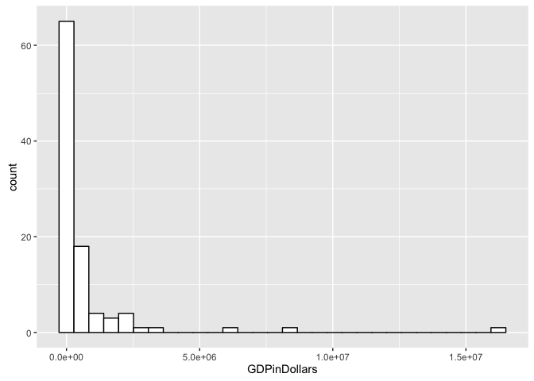
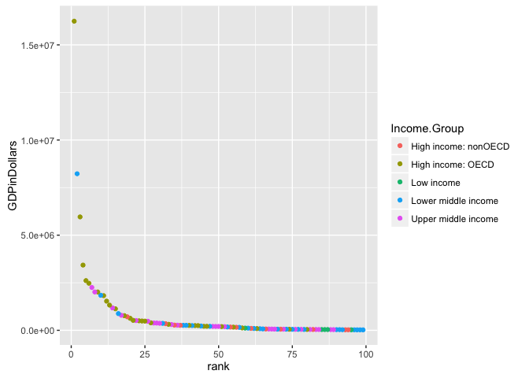

# Analysis of 2016 GDP Data: A Case Study
Tony Garza  
June 20, 2016  


# Introduction

The following R Markdown document is a case study in response to your inquiry about analyzing current GDP trends using data from The World Bank. (Original Data Sources: http://data.worldbank.org/data-catalog/GDP-ranking-table & http://data.worldbank.org/data-catalog/ed-stats). The data is current as of April (for GDP) and May (for Ed-Stats) of 2016.

This study will answer the following questions: <br/>
1. Match the data based on the country shortcode. How many of the IDs match? <br/>
2. Sort the data frame in ascending order by GDP rank (so United States is last). What is the 13th country in the resulting data frame? <br/>
3. What are the average GDP rankings for the "High income: OECD" and "High income: nonOECD" groups? <br/>
4. Plot the GDP for all of the countries. Use ggplot2 to color your plot by Income Group. <br/>
5. Cut the GDP ranking into 5 separate quantile groups. Make a table versus Income.Group. How many countries are Lower middle income but among the 38 nations with highest GDP? <br/>

Additionally, this R Markdown document will break down my processes for data gathering, data tidying, and data analysis used to draw conclusions to the questions stated above.<br/>

# Data Gathering Phase

```r
setwd("~/Dropbox/SMUDataScienceClass/1st class/Week6CaseStudy_Garza") # all important step of setting the working directory
site1 <- "https://d396qusza40orc.cloudfront.net/getdata%2Fdata%2FGDP.csv" # site1 houses the GDP data
download.file(site1, destfile = "./GDP.csv") # store it in GDP data into GDP.csv
site2 <- "https://d396qusza40orc.cloudfront.net/getdata%2Fdata%2FEDSTATS_Country.csv" # site2 houses the EdStats data
download.file(site2, destfile = "./edstats.csv") # store it in edstats.csv
```
Now we need to read the files into data frames in R using this code chunk:

```r
GDPData <- read.csv("GDP.csv", sep = ",", header = TRUE, stringsAsFactors = FALSE)  #read the GDP data into the GDPData data frame
EdStats <- read.csv("edstats.csv", sep = ",", header = TRUE, strip.white = TRUE,
    na.strings= c("NA", " ", "")) # Read the EdStats data into EdStats data frame; Note: I added some code after the face to replace spaces with NAs within EdStats; this is because much of the data here is non-numeric and I need to keep the strings intact; this seemed like the most efficient approach.
```
This may require you to install "gdata" package if not already installed (if necessary use the following commands):<br\>
install.packages("gdata")<br\>
library(gdata) <br\>

# Tidy the Data
Going to break this up into sections. First we'll work on tidying GDPData.

## Tidy GDPData
Now that we have the data read into data frames we need to tidy the data to be able to use it properly.
The following code chunk will tidy the data for "GDPData" data frame. First let's see what we have:

```r
head(GDPData)
```

```
##     X Gross.domestic.product.2012 X.1           X.2          X.3 X.4 X.5
## 1                                  NA                                 NA
## 2                                  NA               (millions of      NA
## 3                         Ranking  NA       Economy  US dollars)      NA
## 4                                  NA                                 NA
## 5 USA                           1  NA United States  16,244,600       NA
## 6 CHN                           2  NA         China   8,227,103       NA
##   X.6 X.7 X.8
## 1  NA  NA  NA
## 2  NA  NA  NA
## 3  NA  NA  NA
## 4  NA  NA  NA
## 5  NA  NA  NA
## 6  NA  NA  NA
```

```r
str(GDPData)
```

```
## 'data.frame':	330 obs. of  10 variables:
##  $ X                          : chr  "" "" "" "" ...
##  $ Gross.domestic.product.2012: chr  "" "" "Ranking" "" ...
##  $ X.1                        : logi  NA NA NA NA NA NA ...
##  $ X.2                        : chr  "" "" "Economy" "" ...
##  $ X.3                        : chr  "" "(millions of" "US dollars)" "" ...
##  $ X.4                        : chr  "" "" "" "" ...
##  $ X.5                        : logi  NA NA NA NA NA NA ...
##  $ X.6                        : logi  NA NA NA NA NA NA ...
##  $ X.7                        : logi  NA NA NA NA NA NA ...
##  $ X.8                        : logi  NA NA NA NA NA NA ...
```
The data is in a bit of a mess and no where close to how we need it. Also, all we need from this data frame is the country code ("country"), the rank ("rank"), and the GDP ("GDPinDollars") <br\>
Note: decided to use "country" as "countrycode" is an R function.

```r
country <- GDPData[1:103,1] #pull out the required country code data
#rank <- as.numeric(GDPData[1:103,2]) #pull out the required rank data and fix the fact that the data is not numeric
rank <- (GDPData[1:103,2])
GDPinDollars <- GDPData[1:103,5] #pull out the required GDP data
CleanGDPdata <- data.frame(country,rank,GDPinDollars) #create a new data frame with this data
CleanGDPdata$rank <- as.numeric(as.character(CleanGDPdata$rank)) # make rank numeric, need as character first because ran is a factor
```

```
## Warning: NAs introduced by coercion
```

```r
CleanGDPdata$GDPinDollars <- as.numeric(gsub("[^[:digit:]]","", CleanGDPdata$GDPinDollars)) #make numeric to identify NAs
CountNAs <- sum(is.na(CleanGDPdata$GDPinDollars)) #need to figure out how many NAs we have in the data set
CountNAs #we have 4 NAs
```

```
## [1] 4
```
There are 4 values in the GDPinDollars column that are NAs and I want to eliminate the rows associated with these NAs <br\>

```r
CleanGDPdata <- na.omit(CleanGDPdata) #elimnate rows where there are NAs
```
## Tidy EdStats Data
Now onto the EdStats data set. First let's see what we have:

```r
head(EdStats)
```

```
##   CountryCode                    Long.Name         Income.Group
## 1         ABW                        Aruba High income: nonOECD
## 2         ADO      Principality of Andorra High income: nonOECD
## 3         AFG Islamic State of Afghanistan           Low income
## 4         AGO  People's Republic of Angola  Lower middle income
## 5         ALB          Republic of Albania  Upper middle income
## 6         ARE         United Arab Emirates High income: nonOECD
##                       Region Lending.category Other.groups  Currency.Unit
## 1  Latin America & Caribbean             <NA>         <NA>  Aruban florin
## 2      Europe & Central Asia             <NA>         <NA>           Euro
## 3                 South Asia              IDA         HIPC Afghan afghani
## 4         Sub-Saharan Africa              IDA         <NA> Angolan kwanza
## 5      Europe & Central Asia             IBRD         <NA>   Albanian lek
## 6 Middle East & North Africa             <NA>         <NA>  U.A.E. dirham
##   Latest.population.census  Latest.household.survey
## 1                     2000                     <NA>
## 2           Register based                     <NA>
## 3                     1979               MICS, 2003
## 4                     1970 MICS, 2001, MIS, 2006/07
## 5                     2001               MICS, 2005
## 6                     2005                     <NA>
##                                                                 Special.Notes
## 1                                                                        <NA>
## 2                                                                        <NA>
## 3 Fiscal year end: March 20; reporting period for national accounts data: FY.
## 4                                                                        <NA>
## 5                                                                        <NA>
## 6                                                                        <NA>
##   National.accounts.base.year National.accounts.reference.year
## 1                        1995                               NA
## 2                        <NA>                               NA
## 3                   2002/2003                               NA
## 4                        1997                               NA
## 5                        <NA>                             1996
## 6                        1995                               NA
##   System.of.National.Accounts SNA.price.valuation
## 1                          NA                <NA>
## 2                          NA                <NA>
## 3                          NA                 VAB
## 4                          NA                 VAP
## 5                        1993                 VAB
## 6                          NA                 VAB
##   Alternative.conversion.factor PPP.survey.year
## 1                          <NA>              NA
## 2                          <NA>              NA
## 3                          <NA>              NA
## 4                       1991-96            2005
## 5                          <NA>            2005
## 6                          <NA>              NA
##   Balance.of.Payments.Manual.in.use External.debt.Reporting.status
## 1                              <NA>                           <NA>
## 2                              <NA>                           <NA>
## 3                              <NA>                         Actual
## 4                              BPM5                         Actual
## 5                              BPM5                         Actual
## 6                              BPM4                           <NA>
##   System.of.trade Government.Accounting.concept
## 1         Special                          <NA>
## 2         General                          <NA>
## 3         General                  Consolidated
## 4         Special                          <NA>
## 5         General                  Consolidated
## 6         General                  Consolidated
##   IMF.data.dissemination.standard
## 1                            <NA>
## 2                            <NA>
## 3                            GDDS
## 4                            GDDS
## 5                            GDDS
## 6                            GDDS
##   Source.of.most.recent.Income.and.expenditure.data
## 1                                              <NA>
## 2                                              <NA>
## 3                                              <NA>
## 4                                         IHS, 2000
## 5                                        LSMS, 2005
## 6                                              <NA>
##   Vital.registration.complete Latest.agricultural.census
## 1                        <NA>                       <NA>
## 2                         Yes                       <NA>
## 3                        <NA>                       <NA>
## 4                        <NA>                    1964-65
## 5                         Yes                       1998
## 6                        <NA>                       1998
##   Latest.industrial.data Latest.trade.data Latest.water.withdrawal.data
## 1                     NA              2008                           NA
## 2                     NA              2006                           NA
## 3                     NA              2008                         2000
## 4                     NA              1991                         2000
## 5                   2005              2008                         2000
## 6                     NA              2008                         2005
##   X2.alpha.code WB.2.code           Table.Name           Short.Name
## 1            AW        AW                Aruba                Aruba
## 2            AD        AD              Andorra              Andorra
## 3            AF        AF          Afghanistan          Afghanistan
## 4            AO        AO               Angola               Angola
## 5            AL        AL              Albania              Albania
## 6            AE        AE United Arab Emirates United Arab Emirates
```

```r
str(EdStats)
```

```
## 'data.frame':	234 obs. of  31 variables:
##  $ CountryCode                                      : Factor w/ 234 levels "ABW","ADO","AFG",..: 1 2 3 4 5 6 7 8 9 10 ...
##  $ Long.Name                                        : Factor w/ 234 levels "American Samoa",..: 5 104 57 99 109 226 4 110 1 2 ...
##  $ Income.Group                                     : Factor w/ 5 levels "High income: nonOECD",..: 1 1 3 4 5 1 5 4 5 5 ...
##  $ Region                                           : Factor w/ 7 levels "East Asia & Pacific",..: 3 2 6 7 2 4 3 2 1 3 ...
##  $ Lending.category                                 : Factor w/ 3 levels "Blend","IBRD",..: NA NA 3 3 2 NA 2 1 NA 2 ...
##  $ Other.groups                                     : Factor w/ 2 levels "Euro area","HIPC": NA NA 2 NA NA NA NA NA NA NA ...
##  $ Currency.Unit                                    : Factor w/ 154 levels "Afghan afghani",..: 7 48 1 4 2 143 5 6 144 43 ...
##  $ Latest.population.census                         : Factor w/ 27 levels "1970","1979",..: 16 27 2 1 17 21 17 17 16 17 ...
##  $ Latest.household.survey                          : Factor w/ 55 levels "CPS (monthly)",..: NA NA 38 37 39 NA NA 15 NA NA ...
##  $ Special.Notes                                    : Factor w/ 69 levels "A simple multiplier is used to convert the national currencies of EMU members to euros. The following irrevocable euro conversi"| __truncated__,..: NA NA 26 NA NA NA NA NA NA 62 ...
##  $ National.accounts.base.year                      : Factor w/ 43 levels "1954","1973",..: 24 NA 37 27 NA 24 21 NA NA 17 ...
##  $ National.accounts.reference.year                 : int  NA NA NA NA 1996 NA NA 1996 NA NA ...
##  $ System.of.National.Accounts                      : int  NA NA NA NA 1993 NA 1993 1993 NA NA ...
##  $ SNA.price.valuation                              : Factor w/ 2 levels "VAB","VAP": NA NA 1 2 1 1 1 1 NA 1 ...
##  $ Alternative.conversion.factor                    : Factor w/ 32 levels "1960-85","1965-84",..: NA NA NA 23 NA NA 5 20 NA NA ...
##  $ PPP.survey.year                                  : int  NA NA NA 2005 2005 NA 2005 2005 NA NA ...
##  $ Balance.of.Payments.Manual.in.use                : Factor w/ 2 levels "BPM4","BPM5": NA NA NA 2 2 1 2 2 NA 2 ...
##  $ External.debt.Reporting.status                   : Factor w/ 3 levels "Actual","Estimate",..: NA NA 1 1 1 NA 1 1 NA NA ...
##  $ System.of.trade                                  : Factor w/ 2 levels "General","Special": 2 1 1 2 1 1 2 2 NA 1 ...
##  $ Government.Accounting.concept                    : Factor w/ 2 levels "Budgetary","Consolidated": NA NA 2 NA 2 2 2 2 NA NA ...
##  $ IMF.data.dissemination.standard                  : Factor w/ 2 levels "GDDS","SDDS": NA NA 1 1 1 1 2 2 NA 1 ...
##  $ Source.of.most.recent.Income.and.expenditure.data: Factor w/ 76 levels "1-2-3, 2005-06",..: NA NA NA 34 65 NA 44 45 NA NA ...
##  $ Vital.registration.complete                      : Factor w/ 1 level "Yes": NA 1 NA NA 1 NA 1 1 1 1 ...
##  $ Latest.agricultural.census                       : Factor w/ 44 levels "1960","1964-65",..: NA NA NA 2 31 31 40 NA NA NA ...
##  $ Latest.industrial.data                           : int  NA NA NA NA 2005 NA 2001 NA NA NA ...
##  $ Latest.trade.data                                : int  2008 2006 2008 1991 2008 2008 2008 2008 NA 2007 ...
##  $ Latest.water.withdrawal.data                     : int  NA NA 2000 2000 2000 2005 2000 2000 NA 1990 ...
##  $ X2.alpha.code                                    : Factor w/ 207 levels "AD","AE","AF",..: 12 1 3 7 5 2 8 6 9 4 ...
##  $ WB.2.code                                        : Factor w/ 208 levels "AD","AE","AF",..: 12 1 3 7 5 2 8 6 9 4 ...
##  $ Table.Name                                       : Factor w/ 234 levels "Afghanistan",..: 10 5 1 6 2 220 8 9 4 7 ...
##  $ Short.Name                                       : Factor w/ 234 levels "Afghanistan",..: 10 5 1 6 2 220 8 9 4 7 ...
```
Let's pull out just the data we need from EdStats:

```r
country <- EdStats[1:234,1] #pull out the required country code data
Income.Group <- EdStats[1:234,3] #pull out the required rank data
CleanEdStats <- data.frame(country,Income.Group) #create a new data frame with this data
CountEdStatsNAs <- sum(is.na(CleanEdStats$Income.Group)) #need to figure out how many NAs we have in the data set
CountEdStatsNAs #we have 24 NAs within EdStats$Income.Group
```

```
## [1] 24
```
We now know that we have 24 NAs in Income.Group. Now let's remove any rows that contain NAs:

```r
CleanEdStats <- na.omit(CleanEdStats) #elimnate rows where there are NAs
```
# Analyze the Data
## Merge the data based on country code. How many of the IDs matched?

```r
MergeGDPData <- merge(x=CleanGDPdata, y=CleanEdStats, by="country", all=TRUE) # Use merge function to bring the two data sets together by country
```
By merging the data we now have introduced NAs into the merged data set as, for example, there are countries in EdStats that are not in GDPData. Therefore, these countries will have an NA for rank and GDPinDollars. This is the clue needed to address the second part of the question: how many of the IDs matched?

```r
sum(!is.na(MergeGDPData$GDPinDollars)) #finding out how many rows in GDPinDollars are not NAs
```

```
## [1] 99
```
This shows us that there are 99 IDs that matched.

## Sort the data frame in ascending order by GDP rank (so United States is last). What is the 13th country in the resulting data frame?
First let's go ahead and eliminate the rows with the new NAs.

```r
MergeGDPData <- na.omit(MergeGDPData) #elimnate rows where there are NAs
```
Actually sorting by the rank column in ascending order would put the United States first with a rank of "1". To make USA last it makes more sense to sort on GDPinDollars column:

```r
require(dplyr) #dplyr required for arrange function
```

```
## Loading required package: dplyr
```

```
## 
## Attaching package: 'dplyr'
```

```
## The following objects are masked from 'package:stats':
## 
##     filter, lag
```

```
## The following objects are masked from 'package:base':
## 
##     intersect, setdiff, setequal, union
```

```r
MergeGDPData <- arrange(MergeGDPData,GDPinDollars) #this arranges the data in ascending order
MergeGDPData #display merged data
```

```
##    country rank GDPinDollars         Income.Group
## 1      CIV   99        24680  Lower middle income
## 2      CMR   98        25322  Lower middle income
## 3      PRY   97        25502  Lower middle income
## 4      BOL   96        27035  Lower middle income
## 5      TZA   95        28242           Low income
## 6      LVA   94        28373 High income: nonOECD
## 7      BHR   93        29044 High income: nonOECD
## 8      JOR   92        31015  Lower middle income
## 9      TKM   91        35164  Lower middle income
## 10     YEM   90        35646  Lower middle income
## 11     PAN   89        36253  Upper middle income
## 12     SRB   88        37489  Upper middle income
## 13     KEN   87        40697           Low income
## 14     GHA   86        40711           Low income
## 15     ETH   85        41605           Low income
## 16     LTU   84        42344  Upper middle income
## 17     LBN   83        42945  Upper middle income
## 18     MAC   82        43582 High income: nonOECD
## 19     CRI   81        45104  Upper middle income
## 20     SVN   80        45279    High income: OECD
## 21     TUN   79        45662  Lower middle income
## 22     URY   78        49920  Upper middle income
## 23     GTM   77        50234  Lower middle income
## 24     BGR   76        50972  Upper middle income
## 25     UZB   75        51113  Lower middle income
## 26     LUX   74        55178    High income: OECD
## 27     SDN   73        58769  Lower middle income
## 28     DOM   72        59047  Upper middle income
## 29     HRV   71        59228 High income: nonOECD
## 30     LKA   70        59423  Lower middle income
## 31     BLR   69        63267  Upper middle income
## 32     AZE   68        66605  Upper middle income
## 33     CUB   67        68234  Upper middle income
## 34     OMN   66        69972 High income: nonOECD
## 35     SYR   65        73672  Lower middle income
## 36     ECU   64        84040  Lower middle income
## 37     SVK   63        91149    High income: OECD
## 38     MAR   62        95982  Lower middle income
## 39     PRI   61       101496 High income: nonOECD
## 40     AGO   60       114147  Lower middle income
## 41     BGD   59       116355           Low income
## 42     HUN   58       124600    High income: OECD
## 43     VNM   57       155820  Lower middle income
## 44     KWT   56       160913 High income: nonOECD
## 45     NZL   55       167347    High income: OECD
## 46     QAT   54       171476 High income: nonOECD
## 47     UKR   53       176309  Lower middle income
## 48     ROM   52       192711  Upper middle income
## 49     CZE   51       196446    High income: OECD
## 50     KAZ   50       203521  Upper middle income
## 51     PER   49       203790  Upper middle income
## 52     DZA   48       205789  Upper middle income
## 53     IRQ   47       210280  Lower middle income
## 54     IRL   46       210771    High income: OECD
## 55     PRT   45       212274    High income: OECD
## 56     PAK   44       225143  Lower middle income
## 57     FIN   43       247546    High income: OECD
## 58     GRC   42       249099    High income: OECD
## 59     PHL   41       250182  Lower middle income
## 60     ISR   40       258217    High income: OECD
## 61     NGA   39       262597  Lower middle income
## 62     EGY   38       262832  Lower middle income
## 63     HKG   37       263259 High income: nonOECD
## 64     CHL   36       269869  Upper middle income
## 65     SGP   35       274701 High income: nonOECD
## 66     MYS   34       305033  Upper middle income
## 67     DNK   33       314887    High income: OECD
## 68     ARE   32       348595 High income: nonOECD
## 69     THA   31       365966  Lower middle income
## 70     COL   30       369606  Upper middle income
## 71     VEN   29       381286  Upper middle income
## 72     ZAF   28       384313  Upper middle income
## 73     AUT   27       394708    High income: OECD
## 74     ARG   26       475502  Upper middle income
## 75     BEL   25       483262    High income: OECD
## 76     POL   24       489795    High income: OECD
## 77     NOR   23       499667    High income: OECD
## 78     IRN   22       514060  Upper middle income
## 79     SWE   21       523806    High income: OECD
## 80     CHE   20       631173    High income: OECD
## 81     SAU   19       711050 High income: nonOECD
## 82     NLD   18       770555    High income: OECD
## 83     TUR   17       789257  Upper middle income
## 84     IDN   16       878043  Lower middle income
## 85     KOR   15      1129598    High income: OECD
## 86     MEX   14      1178126  Upper middle income
## 87     ESP   13      1322965    High income: OECD
## 88     AUS   12      1532408    High income: OECD
## 89     CAN   11      1821424    High income: OECD
## 90     IND   10      1841710  Lower middle income
## 91     ITA    9      2014670    High income: OECD
## 92     RUS    8      2014775  Upper middle income
## 93     BRA    7      2252664  Upper middle income
## 94     GBR    6      2471784    High income: OECD
## 95     FRA    5      2612878    High income: OECD
## 96     DEU    4      3428131    High income: OECD
## 97     JPN    3      5959718    High income: OECD
## 98     CHN    2      8227103  Lower middle income
## 99     USA    1     16244600    High income: OECD
```
Now to determine what the 13th country is I use the following simple code:

```r
MergeGDPData$country[13] # tells me what the 13th value of the vector is
```

```
## [1] KEN
## 235 Levels:  AGO ARE ARG AUS AUT AZE BEL BGD BGR BHR BLR BOL BRA ... ZWE
```
This shows that in this prescribed order, from least to greatest, Kenya is the 13th country.

## What are the average GDP rankings for the "High income: OECD" and "High income: nonOECD" groups? 
Using the subset function I separated out the "High income: OECD and nonOECD" portions of the data.

```r
subsetMergeDataOECD <- subset(MergeGDPData,Income.Group=="High income: OECD") # create subset using OECD
subsetMergeDataNonOECD <- subset(MergeGDPData,Income.Group=="High income: nonOECD") # create another subset using nonOECD
mean(subsetMergeDataOECD$rank) # calulate the mean of the rank data
```

```
## [1] 29.89655
```
This is the average GDP ranking for High Income: OECD subset.

```r
mean(subsetMergeDataNonOECD$rank) # calulate the mean of the rank data
```

```
## [1] 58.33333
```
This is the average GDP ranking for High Income: nonOECD subset.

## Plot the GDP for all of the countries. Use ggplot2 to color your plot by Income Group.
Using ggplot2 I plotted both a histogram and a qplot.

```r
require(ggplot2) # required package for ggplot and qplot
```

```
## Loading required package: ggplot2
```

```r
p <- ggplot(MergeGDPData,aes(GDPinDollars)) # ggplot
p + geom_histogram(fill="white",colour="black") #ggplot commands to display plot
```

```
## `stat_bin()` using `bins = 30`. Pick better value with `binwidth`.
```

<!-- -->
As you can see in the histogram, the GDP data for all the countries is heavily skewed left to the side of more countries having very low GDPs. <br\>

```r
qplot(rank,GDPinDollars, data = MergeGDPData, color=Income.Group) #qplot of rank v GDPinDollars colored by Income.Group category
```

<!-- -->
<br\>

The qplot shows an almost exponential curve with very few countries with high GDPs. It also shows some interesting data that some of the upper middle income countries are also some of the lowest ranking GDP producers. Conversersely, there are also a number of lower middle income countries that are high (or very high) GDP producers. 

```r
sum(MergeGDPData$GDPinDollars[1:94])
```

```
## [1] 34556677
```

```r
sum(MergeGDPData$GDPinDollars[95:99])
```

```
## [1] 36472430
```
In fact this code proves that the top five countries in this data set together have a higher GDP than all the other countries combined.

## Cut the GDP ranking into 5 separate quantile groups. Make a table versus Income.Group. How many countries are Lower middle income but among the 38 nations with highest GDP?
Going to use quantile and cut functions along with dcast to create a table of ranking quantiles and Lower Middle Class data from Income.Group. 

```r
require(gtools)
```

```
## Loading required package: gtools
```

```r
rankcat <- quantile(MergeGDPData$rank, seq(0, 1, length = 6)) #This will give us five separate quantile groups
rankcat
```

```
##   0%  20%  40%  60%  80% 100% 
##  1.0 20.6 40.2 59.8 79.4 99.0
```

```r
require(reshape2) #need to load reshape2
```

```
## Loading required package: reshape2
```

```r
MergeGDPData$quantile <- cut(MergeGDPData$rank, breaks = rankcat) 
dcast(MergeGDPData, quantile ~ Income.Group, length, value.var = "quantile")[, c("quantile", 
    "Lower middle income")] #create a table of quantile group vs Lower middle income from Income.Group
```

```
##      quantile Lower middle income
## 1    (1,20.6]                   3
## 2 (20.6,40.2]                   3
## 3 (40.2,59.8]                   5
## 4 (59.8,79.4]                   9
## 5   (79.4,99]                   7
## 6        <NA>                   0
```

```r
dcast(MergeGDPData, quantile ~ Income.Group, length, value.var = "quantile")[1, c("Lower middle income")] #calculate how many Lower Middle Income countries are also in top 38 countries in GDP.
```

```
## [1] 3
```
There are a total of three Lower middle income countries that are also in the top 38 countries in GDP.

# Conclusion
In this case study we learned the severe difference between the production of the top highest producing countries in the world versus the production of the remainder of the world's countries. I gathered the most recent GDP data from the World Bank website along with data on household income. I then merged the two data sets to be able to gather additional insights and manipulate the data easier. I found that not only is the data severely skewed (as evident by the above histogram and qplot, it is almost exponential in the severity of its curve. The data was not ready to be used right away and this required me to condense and tidy the data. This included identifying and removing NAs, Making sure data was numerical (sometimes looked numerical but was really a character string), and condensing the data. I also removed extraneous rows, and renamed column names to match and assist in merging of data on a common variable. When these tidying tasks were complete I moved on to the analysis where I prepared the data for each analysis question asked. Here I used a combination of merge, ggplot, and quantile functions to come to assist in drawing conclusions about the data.
